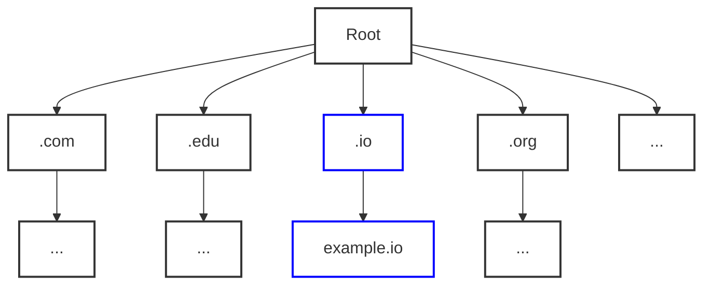
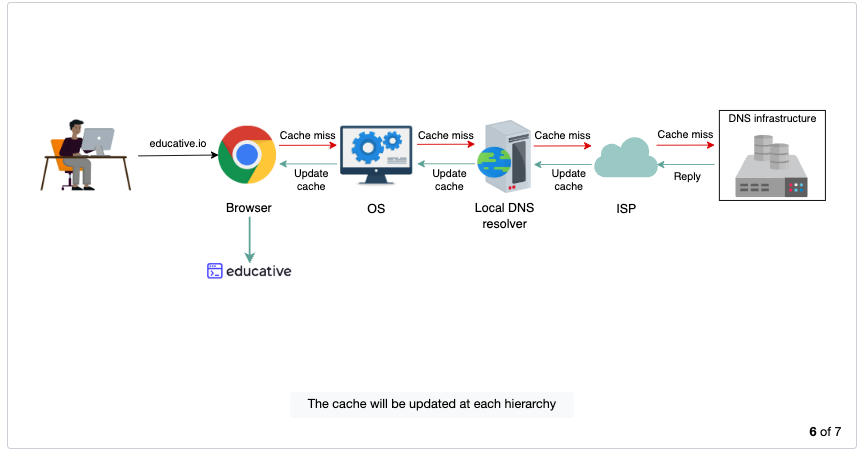

# Domain Name System (DNS)

## Example

### Phone Book

* Example of mobile phone where a unique number is associated with each user
* To make calls to friends, we can initially try to memorize some of the phone numbers
* As the number of contact grows, we'll have to use a phone book to keep track to all our contacts
* This way, whenever we need to make a call, we'll refer to the phone book and dial the number we need

### DNS

* Similarly, computers are uniquely assigned by IP address - for example, ```104.18.2.119``` is an IP address.
* Since, it is not possible to remember IP address to visit domain names (```google.com```), we need a repository, similar to phone book, that can maintain all the mappings of domain names to IP addresses.

## What is DNS?

* It maps human-friendly domain names to machine readable IP addresses.
* When a user enters a domain name in the browser, the browser has to translate the domain name to an IP address by asking the DNS infrastructure
* Once the desired IP address is obtained, the yser's request is forwarded to the destination web server


## Key Properties and Details

* **Name Servers:** DNS isn't a single server. It's complete infrastructure with numerous servers. DNS servers that respond to user queries are called name servers.
* **Resource Records:** DNS database stores domain name to IP address mappings in the form of resource records(RRs). The RR is smallest unit of information that users request from the name servers.
* Different types of RRs:
    * type
    * name
    * value

## Common Types of Resource Records

| Type | Description | Name | Value | Example (Type, Name, Value) |
| ---- | ----------- | ---- | ----- | --------------------------- |
| A | Provides the hostname to IP address mapping | Hostname | IP address | (A, relay.main.example.com, 110.18.2.119) |
| NS | Provides the hostname that is the authoritative DNS for a domain name | Domain Name | Hostname | (NS, google.com, dns.google.com) |
| CNAME | Provides the mapping from an alias to the canonical hostname | Hostname | Canonical name | (CNAME, google.com, server1.primary.google.com) |
| MX | Provides the mapping of the mail server from the alias to the canonical hostname| Hostname | Canonical name | (MX, mail.google.com, mailserver1.backup.google.com) |

* **Caching**: The DNS uses caching at different layers to reduce request latency for the user. Caching plays an important role in reducing the burden on DNS infrastructure because it has to cater to the queries of the entire Internet.

* **Hierarchy**: DNS name servers are in a hierarchical form. The hierarchical structure allows the DNS to be highly scalable because of its increasing size and query load. Tree-like structure is used to manage the entire DNS database.

## Types of Server in the DNS Hierarchy

* **DNS resolver:** Resolvers initiate the querying sequence and forward requests to the other DNS name servers. Typically, DNS resolvers lie within the premise of the user’s network. However, DNS resolvers can also cater to users’ DNS queries through caching techniques. These servers can also be called local or default servers.

* **Root-level name server:** These servers receive requests from local servers. Root name servers maintain name servers based on top-level domain names, such as .com, .edu, .us, and so on. For instance, when a user requests the IP address of ```google.com```, root-level name servers will return a list of top-level domain (TLD) servers that hold the IP addresses of the .com domain.

* **Top-level domain (TLD) name servers:** These servers hold the IP addresses of authoritative name servers. The querying party will get a list of IP addresses that belong to the authoritative servers of the organization.

* **Authoritative name servers:** These are the organization’s DNS name servers that provide the IP addresses of the web or application servers.



## Iterative versus recursive query resolution

* **Iterative:** The local server requests the root, TLD, and the authoritative servers for the IP address.
* **Recursive:** The end user requests the local server. the local server further requests the root DNS name servers. The root name servers forward the requests to other name servers.

>**Note:** An iterative query is typically preferred to reduce query load on the DNS infrastructure.

## Power of caching in the DNS



>**Note:** There are 13 logical root name servers (named letter “A” through “M”) with many instances spread throughout the globe. These servers are managed by 12 different organizations.

## DNS as a distributed system

* It avoids becoming a single point of failure (SPOF).
* It achieves low query latency so users can get responses from nearby servers.
* It gets a higher degree of flexibility during maintenance and updates or upgrades. For example, if one DNS server is down or overburdened, another DNS server can respond to user queries.

##### Question: To maintain high availability, should the time-to-live (TTL) value be large or small?
>**Answer** To maintain high availability, the TTL value should be small. This is because if any server or cluster fails, the organization can update the resource records right away. Users will experience nonavailability only for the time the TTL isn’t expired. However, if the TTL is large, the organization will update its resource records, whereas users will keep pinging the outdated server that would have crashed long ago. Companies that aim for high availability maintain a TTL value as low as 120 seconds. Therefore, even in case of a failure, the maximum downtime is a few minutes.

* **Protocol:** Although many clients use the DNS over unreliable user datagram protocol (UDP), UDP has its advantages. UDP is much faster and therefore improves DNS performance. Furthermore, Internet service reliability has improved since its inception, so UDP is usually favored over TCP. A DNS resolver can resend the UDP request if it didn’t get a reply to a previous one. This request-response needs just one round trip, which provides a shorter delay as compared to TCP, which needs a three-way handshake before data exchange.

##### Question: What happens if a network is congested? Should the DNS continue using UDP?
>**Answer** Typically, the DNS uses UDP. However, the DNS can use TCP when its message size exceeds the original packet size of 512 bytes. This is because large-size packets are more prone to be damaged in congested networks. The DNS always uses TCP for zone transfers. Some clients prefer the DNS over TCP to employ transport layer security for privacy reasons.

* [Updated List of 13 root serves](https://www.internic.net/domain/named.root)